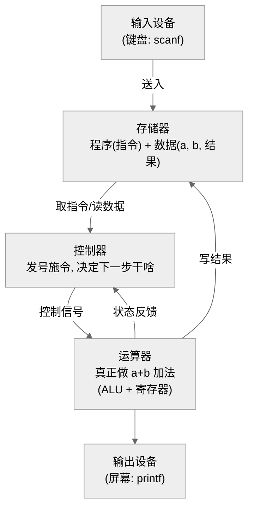

> ← [[02a_序章_四个前置概念|上一章：序章]] | [[02_a+b学习手册|📖 目录]] | [[02c_第2章_运算方法与运算器|下一章：第2章 →]]

---

# 第 1 章　计算机系统概论 —— a+b 住进了一台什么样的机器

> **a+b 在这一章**：我（a+b.c）还是一段人类能读的文字。这一章先搞清楚两件事：①我最终要被翻译成什么、住进一台什么结构的机器；②怎么衡量这台机器跑得快不快。

---

## 1.1 计算机分两类，我们只关心"数字计算机"

**【知识点·数字 vs 模拟计算机】**
- 🎓 数字计算机用离散的二进制 0/1 表示和处理信息，精度高、可编程、逻辑判断强；模拟计算机用连续的电压/电流表示量，精度低。
- 🌱 数字机像"用算盘一颗一颗拨"，模拟机像"用水位高低估个大概"——我们今天的电脑、手机全是数字机。

我们的 a+b 里的整数、加法，全靠 0/1 来表示和计算，所以它活在数字计算机里。

---

## 1.2 计算机硬件：五大部件（冯·诺依曼结构）

这是**整门课的地基**，必须刻进脑子。



> CPU = 控制器 + 运算器（+ Cache（高速缓存）——CPU 内部用来减少访问内存次数的小型快速存储器）

**【知识点·五大部件分工】**（用做一道算术题来类比，课本原话）

| 部件 | 职责 | 类比"人做题" | 在 a+b 里 |
|------|------|-------------|-----------|
| 运算器 | 算术/逻辑运算 | 大脑做计算 | 算 a+b |
| 控制器 | 指挥、按序取指执行 | 大脑做决策 | 决定先取a、再取b、再加 |
| 存储器 | 存程序和数据 | 记忆/草稿纸 | 存指令、a、b、结果 |
| 输入设备 | 外部信息→机器内部 | 笔（写入） | 键盘把 a、b 送进来 |
| 输出设备 | 机器结果→人能懂 | 纸（呈现） | 屏幕显示和 |

**【知识点·冯·诺依曼三大思想】**（高频简答）
- 🎓 ①存储程序：指令和数据都以二进制形式预先存入存储器；②程序控制：按地址自动顺序执行指令；③以运算器为中心（早期）。
- 🌱 ①菜谱和食材都放进同一个冰箱；②照着菜谱一步步自动做，不用人喊一下动一下；③所有东西都先过"计算台"那张桌子。

> 🔑 **易错**：早期冯氏机"以运算器为中心"导致运算器成瓶颈，改进型改为"**以存储器为中心**"。

---

## 1.3 计算机软件：系统软件 + 应用软件

**【知识点·软件两大类】**
- 🎓 系统软件（OS（Operating System，操作系统——管理硬件资源的大管家，比如 Windows/Linux）、编译器/汇编器、DBMS（Database Management System，数据库管理系统——专门管数据的软件，比如 MySQL）、服务程序）用于管理机器、简化编程；应用软件是为解决具体问题编写的程序。
- 🌱 系统软件是"管家和翻译"，应用软件是"你请来干具体活的工人"——你的 a+b 就是应用软件，而把它翻译成机器码的编译器是系统软件。

**【知识点·编程语言的进化】**
- 🎓 机器语言（二进制）→ 汇编语言（助记符，需汇编器翻译）→ 高级语言（C/Python，需编译器或解释器翻译）。
- 🌱 从"直接写暗号"→"写英文缩写再翻译"→"写接近人话的代码再翻译"，越往上越省脑子。

---

## 1.4 计算机系统的层次结构（虚拟机概念）

这一节解释**"我的 a+b.c 是怎么一层层落到硬件上的"**。

```
 你写 a+b.c (M5 高级语言级)
      │ 编译器 gcc 翻译
      ▼
 汇编代码 ADD/MOV... (M4 汇编语言级)   ← 给人看的助记符
      │ 汇编器翻译
      ▼
 机器指令 一串01 (M2 机器语言级)        ← CPU 真正认识的
      │ 由微程序解释
      ▼
 微指令 (M1 微程序级)                   ← 把一条指令拆成更细的动作
      │
      ▼
 门电路/触发器 (M0 硬联逻辑级)          ← 最底层硬件
（中间还有 M3 操作系统级、M6 应用程序级）
```

**【知识点·虚拟机与透明性】**
- 🎓 每一层用下层语言实现，对上层表现为一台"虚拟机"；下层的实现细节对上层"透明"（确实存在但上层看不见、无需关心）。
- 🌱 你点外卖只说"要宫保鸡丁"，厨房怎么炒你看不见也不用管——这"看不见"就叫透明。

**【知识点·系统结构 / 组成 / 实现（必考辨析）】**
- 🎓 系统结构=程序员可见的属性（指令系统、数据表示、寻址方式…），定义软硬件分界面；组成=系统结构的逻辑实现；实现=组成的物理实现。
- 🌱 结构="这道菜要有麻和辣"，组成="用花椒还是辣椒油来实现麻辣"，实现="具体买哪个牌子的花椒"。

> 🔑 例子记忆：是否要乘法指令→**结构**；乘法用乘法器还是加法器累加→**组成**；乘法器用什么芯片工艺→**实现**。

**【知识点·系列机 / 兼容 / 模拟仿真】**
- 🎓 系列机=系统结构相同但组成实现不同的一系列机器；软件兼容要求"向后兼容必须做到"（旧程序能在新机跑）；模拟=用软件在A机实现B机指令系统，仿真=用微程序（固件）实现。
- 🌱 同一品牌不同年份的手机能装同一个App，就是系列机+向后兼容；在电脑上用模拟器玩老游戏机，就是模拟/仿真。

---

## 1.5 计算机性能指标（计算题高频）

**【知识点·核心性能公式】**
- 机器字长：运算器一次能处理的二进制位数（8/16/32/64）。我们的 `int a` 通常 32 位，就和字长相关。
- 吞吐量、响应时间、利用率、主频 f、时钟周期 T=1/f。

> **必背三个公式**（几乎每年计算题）：
> ```
> CPU执行时间 Te = 时钟周期数 × T = 指令条数IC（Instruction Count，程序总共执行了多少条指令）× CPI（Cycles Per Instruction，每条指令平均耗费几个时钟周期）× (1/f)
> CPI = 总时钟周期数 / 总指令条数      （每条指令平均几个时钟周期）
> MIPS（Millions of Instructions Per Second，每秒执行多少百万条指令）= f / (CPI × 10⁶) = IC / (Te × 10⁶)
> MFLOPS（Millions of FLOating-Point Operations Per Second，每秒执行多少百万次浮点运算）= 浮点操作次数 / (执行时间 × 10⁶)
> ```

🎓 **专业版**：程序执行时间由指令条数、每条指令的平均时钟周期数(CPI)和时钟周期三者共同决定。
🌱 **大白话**：跑完一段程序要多久 = 一共多少条指令 × 每条平均几拍 × 每拍多少秒。三者任一个变小，程序就更快。

**【知识点·Amdahl 定律（加速比，必考）】**
- 🎓 系统某部件加速后，整体性能提升受该部件原占用时间比例 Fe 限制：
  ```
  加速比 S = 1 / [ (1 − Fe) + Fe / Se ]
  Fe = 可改进部分占原时间的比例；Se = 该部分的加速倍数
  ```
- 🌱 你只把"占全程 40% 的那段路"提速 10 倍，整体也快不到 10 倍——因为另外 60% 没变。**"加快经常发生的事"才划算**。

> **例**（课本例题）：某部件占时 40%(Fe=0.4)，加速到 10 倍(Se=10)：
> S = 1/[(1−0.4)+0.4/10] = 1/(0.6+0.04) = 1/0.64 ≈ **1.5625 倍**。

---

## 1.6 计算机系统结构分类（Flynn 分类，选择题常客）

**【知识点·Flynn 分类】**
- 🎓 按指令流、数据流的多倍性分四类：

| 类型 | 含义 | 代表 |
|------|------|------|
| SISD | 单指令流单数据流 | 传统单处理器 |
| SIMD | 单指令流多数据流 | 向量机/阵列机/GPU（Graphics Processing Unit，图形处理器）|
| MISD | 多指令流单数据流 | **实际不存在** |
| MIMD | 多指令流多数据流 | 多核/多处理器/机群 |

- 🌱 SISD=一个厨师做一道菜；SIMD=一个口令让一排士兵同时做同一动作；MIMD=多个厨师各做各的菜；MISD=几个厨师对同一块肉做不同处理——现实里没人这么干。

---

## ⭐ 本章在 a+b 故事里的位置

我们搞清了：a+b.c 会被**层层翻译**成机器指令，住进一台**冯·诺依曼五大部件**的机器；这台机器跑得快不快由**指令数×CPI×时钟周期**决定。下一章，我们要解决最根本的问题：**a 和 b 这两个整数，到底在机器里长什么样、加法怎么算。**

---

> [!question]- 🧪 费曼检验区（合上笔记，用自己的话说）
> 
> **规则**：合上笔记，试着**说给完全不懂的人听**。卡壳了就说明没真懂，回头重读。
> 
> **📌 老师划重点**
> - 选择题会考 SRAM/DRAM 区别等上课概念
> - 冯·诺依曼三特点是简答/选择常客
> 
> **📊 教材核心考点**
> 1. 冯·诺依曼计算机的三个核心思想是什么？用自己的话各说一句。
> 2. "系统结构"、"组成"、"实现"三者有什么区别？能举个例子说清楚吗？
> 3. CPU执行时间 = 指令数 × CPI × 时钟周期——这三个量分别由谁决定？（程序员？编译器？硬件？）
> 4. Amdahl定律说的是什么？如果一个程序40%的时间花在某部分，那部分加速10倍，整体能快多少？
> 5. 你写的C程序是怎么一步步变成CPU能执行的01串的？经过哪几层翻译？

---

## 📝 章节小测

> 先动笔算，再翻答案。每题标注了对应的考试题型。

**【题 1 · 判断】** "MIPS 值越大的机器，运行任何程序都一定越快。" 对还是错？

**【题 2 · 计算 · CPI/MIPS】** 某 CPU 主频 800MHz，执行一段程序共 200 万条指令，耗时 5ms。求 CPI 和 MIPS。

**【题 3 · 计算 · Amdahl】** 某程序中浮点运算占总执行时间的 60%，现将浮点部件加速到原来的 20 倍。求整体加速比。如果希望整体加速到 3 倍，浮点部件至少要加速多少倍？

**【题 4 · 选择 · Flynn】** 以下哪种 Flynn 分类在实际中不存在？A. SISD　B. SIMD　C. MISD　D. MIMD

> [!tip]- 参考答案（点击展开）
> **题 1**：**错**。MIPS 只衡量"每秒执行多少百万条指令"，不同指令系统的指令复杂度不同，MIPS 高不代表完成同一任务更快。例如 CISC（Complex Instruction Set Computer，复杂指令集计算机——指令种类多且功能强，一条顶 RISC 好几条）一条指令做的事可能顶 RISC（见序章注释）好几条，MIPS 低但任务更快。MIPS **只适合同一指令系统内比较**。
>
> **题 2**：
> - 总时钟周期数 = 主频 × 执行时间 = 800×10⁶ × 5×10⁻³ = **4×10⁶ = 400 万周期**
> - CPI = 总周期 / 指令条数 = 4×10⁶ / 2×10⁶ = **2**
> - MIPS = 指令条数 / (执行时间 × 10⁶) = 2×10⁶ / (5×10⁻³ × 10⁶) = **400 MIPS**
> - 验证：MIPS = f / (CPI × 10⁶) = 800×10⁶ / (2 × 10⁶) = 400 ✓
>
> **题 3**：
> - Fe=0.6, Se=20：S = 1/[(1−0.6) + 0.6/20] = 1/(0.4 + 0.03) = 1/0.43 ≈ **2.33 倍**
> - 要 S=3：3 = 1/[(1−0.6) + 0.6/Se] → 0.4 + 0.6/Se = 1/3 → 0.6/Se = 1/3 − 0.4 = −1/15 → **不可能**。即使浮点部件无限快（Se→∞），S 最大 = 1/0.4 = 2.5 倍，**达不到 3 倍**。这就是 Amdahl 定律的核心教训：不可加速部分(40%)是瓶颈上限。
>
> **题 4**：**C. MISD**。多指令流单数据流在实际中不存在——多个指令对同一数据做不同处理的架构没有实用价值。

## 🎯 本章高频考点 & 易错坑
- 简答：冯·诺依曼三特点、五大部件、系统结构/组成/实现区别。
- 计算：CPU时间/CPI/MIPS、Amdahl 加速比。
- 选择：Flynn 分类、透明性、向后兼容。
- ⚠️ 坑：MIPS 不能跨不同指令系统比快慢；Amdahl 中"提速的只是 Fe 那部分"；早期冯氏机是"以运算器为中心"。

---

> ← [[02a_序章_四个前置概念|上一章：序章]] | [[02_a+b学习手册|📖 目录]] | [[02c_第2章_运算方法与运算器|下一章：第2章 →]]
